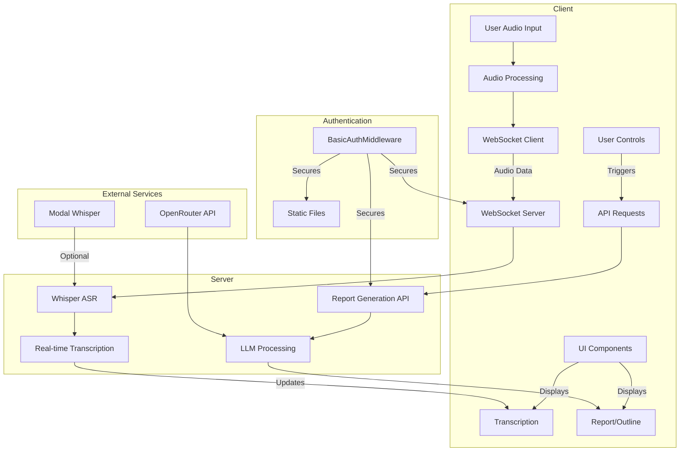

# Pensieve: Real-time Speech-to-Text Transcription and Report Generation

Pensieve is a simple web application that provides real-time speech-to-text transcription using Whisper models and generates structured reports from the transcribed content.

## Features

- Real-time audio transcription using Faster Whisper models
- Automatic LLM powered report generation
- Secure access with HTTP Basic Authentication
- Audio visualization during recording
- Save and download transcripts and reports
- Customizable settings for language and models

## Architecture



## Security

The application implements HTTP Basic Authentication to secure all routes:

- All HTTP routes, WebSocket connections, and static files are protected
- Authentication credentials are stored in environment variables (`APP_USERNAME` and `APP_PASSWORD`)
- Secure password comparison using `secrets.compare_digest` to prevent timing attacks
- Auto-generated secure password if not explicitly set

## Installation

### Prerequisites

- Python 3.12 or higher
- Node.js and npm (for frontend development)

### Setup

1. Clone the repository:
   ```bash
   git clone https://github.com/yourusername/pensieve.git
   cd pensieve
   ```

2. Create a virtual environment and install dependencies:
   ```bash
   python -m venv venv
   source venv/bin/activate  # On Windows: venv\Scripts\activate
   pip install -e .
   ```

3. Create a `secret_keys.py` file with your API keys:
   ```python
   OPENROUTER_KEY = "your_openrouter_api_key"
   ```

4. Set environment variables for authentication (optional):
   ```bash
   export APP_USERNAME="your_username"
   export APP_PASSWORD="your_secure_password"
   ```
   If not set, the application will generate a secure random password and display it in the console.

## Running the Application

Start the FastAPI server:

```bash
uvicorn stt_server:app --reload
```

Access the application at http://localhost:8000

## Development Guide

### Project Structure

- `stt_server.py`: Main FastAPI application with WebSocket handling and API endpoints
- `index.html`: Main HTML template for the web interface
- `static/`: Directory containing CSS, JavaScript, and other static assets
- `whisper_streamer/`: Package for real-time Whisper ASR processing
- `report_generator.py`: Functions for generating outlines and reports from transcripts
- `modal_whisper.py`: Integration with Modal for optional cloud-based transcription

### Adding New Features

1. **Frontend Modifications**:
   - Edit `index.html` for UI changes
   - Modify `static/script.js` for client-side functionality
   - Update `static/styles.css` for styling

2. **Backend Modifications**:
   - Add new endpoints to `stt_server.py`
   - Extend report generation in `report_generator.py`
   - Modify Whisper integration in `whisper_streamer/`

3. **Authentication**:
   - The `BasicAuthMiddleware` in `stt_server.py` handles authentication
   - Modify as needed for different auth mechanisms

### Testing

- Manual testing of the web interface
- Test WebSocket connections with the browser's developer tools
- Test API endpoints with tools like curl or Postman

## Deployment

### Local Deployment

For local deployment, follow the installation and running instructions above.

### Production Deployment

For production deployment:

1. Set environment variables for authentication:
   ```bash
   export APP_USERNAME="your_username"
   export APP_PASSWORD="your_secure_password"
   ```

2. Use a production ASGI server like Uvicorn with Gunicorn:
   ```bash
   gunicorn -k uvicorn.workers.UvicornWorker -w 4 stt_server:app
   ```

3. For secure access, deploy behind a reverse proxy like Nginx or use Cloudflare Tunnel.

## License

[MIT License](LICENSE)